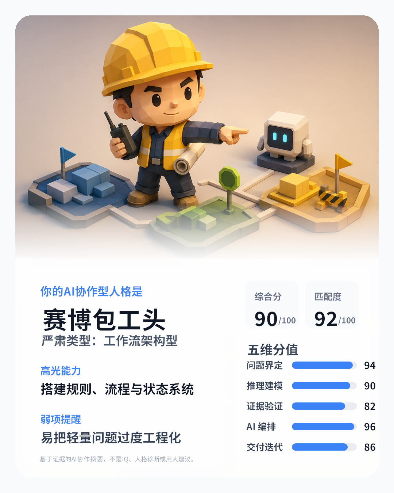

# AI Collab Scorecard


AI Collab Scorecard is a Codex skill for evaluating long-term AI/Codex collaboration records. It turns chat history, prompts, corrections, tool traces, and produced artifacts into an evidence-grounded scorecard.

It is designed for work review, coaching, and collaboration pattern analysis. It is not an IQ test, personality diagnosis, hiring decision tool, or clinical assessment.

## Preview

The serious scorecard is the source of truth. The share card is a lightweight derivative generated from the same scored JSON.



See [`examples/`](examples/) for a sample scorecard JSON and the rendered PNG.

## What It Outputs

- 五个单维度整数分值，满分 100
- 综合整数分值，满分 100
- 证据置信度
- AI 协作工作型与匹配度
- 第二倾向与风险修正
- 各维度证据
- 能力画像、主要瓶颈与改进建议
- 可选的确定性分享图 PNG

## Quick Start For Codex

Send this single message to Codex:

```text
请安装并运行 AI Collab Scorecard：https://github.com/bagbag16/ai-collab-scorecard。优先执行仓库里的 scripts/bootstrap.ps1 自动完成下载、安装、更新、自检和可补齐项；我授权本轮进行必要的联网下载、写入本地 Codex skills、安装 PyYAML、运行自检，并只读访问当前 Codex/当前软件历史作为测评语料。仅限 Codex/当前软件历史，不读浏览器、凭据或无关目录。全程低打扰，最终只输出一份中文完整结果；遇到越界或无法补齐项时只列最小下一步。
```

Codex should run `scripts/bootstrap.ps1`, install or update the skill, validate the environment, and continue in the same chat.

## Manual Install Without Git

Run this in PowerShell only when you are installing manually without Codex. It downloads the zip package and then runs the same bootstrap path:

```powershell
$Url="https://github.com/bagbag16/ai-collab-scorecard/archive/refs/heads/main.zip"; $Zip=Join-Path $env:TEMP "ai-collab-scorecard.zip"; $Extract=Join-Path $env:TEMP "ai-collab-scorecard-download"; Remove-Item -Recurse -Force $Extract -ErrorAction SilentlyContinue; [Net.ServicePointManager]::SecurityProtocol=[Net.ServicePointManager]::SecurityProtocol -bor [Net.SecurityProtocolType]::Tls12; Invoke-WebRequest -UseBasicParsing $Url -OutFile $Zip; Expand-Archive $Zip -DestinationPath $Extract -Force; $Src=Join-Path $Extract "ai-collab-scorecard-main"; powershell -NoProfile -ExecutionPolicy Bypass -File (Join-Path $Src "scripts\bootstrap.ps1") -SourcePath $Src
```

## Repository Layout

- `SKILL.md`: Codex-facing workflow and guardrails
- `references/`: scoring rubric, output schema, worktypes, sampling and data-source rules
- `scripts/`: deterministic validation, extraction, classification, bootstrap, and rendering tools
- `assets/`: fixed worktype illustrations and pinned Chinese font for standard share-card rendering
- `examples/`: public, privacy-safe sample input/output artifacts
- `docs/productization-roadmap.md`: productization checklist and remaining owner decisions

The bootstrap installer copies only `SKILL.md`, `agents/`, `assets/`, `references/`, and `scripts/` into the local Codex skill directory. Repo-facing docs and examples are intentionally not installed as runtime skill context.

## Validation

Run the repository validator:

```powershell
python scripts/validate_repo.py
```

Run the deterministic image self-check on Windows:

```powershell
powershell -NoProfile -ExecutionPolicy Bypass -File .\scripts\self_check_render_determinism.ps1
```

## Privacy Boundary

The skill must not silently read local history. If current Codex/software history is needed, it should ask for explicit read-only permission first. If permission is not granted, or the local history is unavailable, unreadable, encrypted, proprietary, or mixed with unrelated private data, use an exported transcript or a user-specified directory instead.

See [`PRIVACY.md`](PRIVACY.md) for the repository privacy model.

## Security

This repository contains local scripts intended to run under user control. Review [`SECURITY.md`](SECURITY.md) before running it on sensitive machines or with private corpora.

## License

No open-source license has been granted yet. See [`LICENSE`](LICENSE). The repository owner should choose a final license before broad public distribution.
